# ArbiTrace Agent 🤖

AI-powered arbitrage trading agent for Cronos testnet that monitors CEX/DEX price spreads and executes profitable trades using Google Gemini AI decision-making.

## Features

- 🧠 **AI-Powered Decisions** - Google Gemini evaluates market conditions, volatility, and risk
- 📊 **Real-time Price Monitoring** - Tracks Crypto.com (CEX) and VVS Finance (DEX)
- ⚡ **Automated Execution** - Executes trades via X402 settlement protocol
- 🛡️ **Risk Management** - Portfolio exposure limits, slippage protection, validation layers
- 📈 **Performance Tracking** - Trade history, win rates, and AI-driven insights

## Architecture

```mermaid
graph TB
    subgraph "Data Sources"
        A[Crypto.com API<br/>CEX Prices]
        B[VVS Finance Pool<br/>DEX Prices]
    end

    subgraph "ArbiTrace Agent"
        C[Orchestrator Loop<br/>30s Intervals]
        D[Tool 1: CEX Prices]
        E[Tool 2: DEX Data]
        F[Tool 3: Spread Calculator]
        G[Tool 4: Gas Estimator]
        H[Gemini AI Decision Engine]
        I[Tool 6: Trade Validator]
        J[Tool 7: Swap Builder]
        K[Tool 8: X402 Signer]
        L[Tool 9: Trade Executor]
        M[Tool 10: Result Tracker]
    end

    subgraph "Blockchain Layer"
        N[ArbiTrace Router<br/>Smart Contract]
        O[Strategy Vault<br/>Fund Management]
        P[X402 Settler<br/>Settlement Protocol]
        Q[VVS Router<br/>DEX Swaps]
    end

    A --> D
    B --> E
    C --> D
    C --> E
    D --> F
    E --> F
    F --> G
    G --> H
    H -->|shouldExecute?| I
    I --> J
    J --> K
    K --> L
    L --> N
    N --> O
    N --> Q
    L --> P
    P --> M
    M --> C

    style H fill:#4285f4,color:#fff
    style N fill:#00897b,color:#fff
    style P fill:#00897b,color:#fff
```



## Quick Start

### Prerequisites

- Node.js v18+ (v23.6.1 used in development)
- npm or yarn
- Cronos testnet wallet with CRO and USDC

### Installation

```bash
# Clone the repository
git clone <your-repo-url>
cd agent

# Install dependencies
npm install

# Build TypeScript
npm run build
```

### Configuration

Create `.env` file from example:
Edit `.env` with your credentials:

```bash
# Network Configuration
CRONOS_RPC_URL=https://evm-t3.cronos.org
CHAIN_ID=338

# Smart Contract Addresses (from deployments.json)
CONTRACT_ARBITRACE_ROUTER=0xb65f1D179b40b82acF041743bB1ed8E8bc4033fb
CONTRACT_X402_SETTLER=0x5b7B948D3Ffd6147a4A662632387159D1A1c6dA4
CONTRACT_STRATEGY_VAULT=0x3200dA9D020B77EbB9Ce4C73eFDd97E826C8Fb5c
CONTRACT_VVS_ROUTER=0x3640a1271AB6735E7B29345E90d3C33529Eb9a8b
CONTRACT_USDC=0x871be6C64c961DE141De862CBdD27DDeBB9DeCd7
CONTRACT_CRO=0xa9d4b4f1AE414aDF72136A6aA4beb6CE466ADEB0

# Agent Wallet (⚠️ TESTNET ONLY)
AGENT_PRIVATE_KEY=your_private_key_here
RECIPIENT_ADDRESS=your_wallet_address_here

# AI Configuration
GEMINI_API_KEY=your_gemini_api_key_here

# Trading Parameters
DEFAULT_POSITION_SIZE=1
MIN_SPREAD_PERCENT=0.5
MAX_PORTFOLIO_EXPOSURE=100
SCAN_INTERVAL_MS=30000
```

### Fund Your Wallet

1. Get testnet CRO from [Cronos Faucet](https://cronos.org/faucet)
2. Get testnet USDC from your deployed contracts
3. The agent will auto-fund the Strategy Vault on first run

### Run the Agent

```bash
# Start the agent
npm start
```

The agent will:
1. Initialize signer and check balances
2. Fund Strategy Vault (if needed)
3. Start scanning every 30 seconds
4. Execute trades when AI approves opportunities

## How It Works

### Trade Execution Flow

1. **Data Gathering** - Fetch CEX (Crypto.com) and DEX (VVS) prices
2. **Spread Analysis** - Calculate price difference and potential profit
3. **AI Decision** - Gemini evaluates:
   - Spread vs gas costs
   - Market volatility
   - Historical win rate
   - Portfolio exposure
   - Risk factors
4. **Trade Validation** - Check balances, approvals, and risk limits
5. **Execution** - Build swap, sign X402 payload, execute trade
6. **Settlement** - X402 settler transfers funds to recipient
7. **Tracking** - Record results and update statistics
8. **AI Insights** - Performance analysis after 3+ trades

### AI Decision Criteria

Gemini AI rejects trades when:
- ❌ Spread too small (< gas costs)
- ❌ Volatility too high (> 10%)
- ❌ Portfolio exposure exceeds limits
- ❌ Historical win rate low (< 60%)
- ❌ Honeypot/rug pull indicators detected

## Project Structure

```
agent/
├── src/
│   ├── ai/
│   │   └── gemini-decision.ts      # Gemini AI integration
│   ├── config/
│   │   └── config-prod.ts          # Environment & constants
│   ├── providers/
│   │   └── contract-provider.ts    # Ethers.js setup
│   ├── tools/
│   │   ├── tool-1-cex-prices.ts    # Crypto.com API
│   │   ├── tool-2-dex-data.ts      # VVS pool reader
│   │   ├── tool-3-calculate-spread.ts
│   │   ├── tool-4-gas-info.ts
│   │   ├── tool-5-historical.ts
│   │   ├── tool-6-validate-trade.ts
│   │   ├── tool-7-build-swap.ts
│   │   ├── tool-8-sign-x402.ts
│   │   ├── tool-9-execute-trade.ts
│   │   └── tool-10-track-result.ts
│   ├── orchestrator-prod.ts        # Main execution loop
│   └── index.ts                    # Entry point
├── .env.example
├── package.json
└── README.md
```

## Environment Variables

| Variable | Description | Required |
|----------|-------------|----------|
| `CRONOS_RPC_URL` | Cronos testnet RPC endpoint | ✅ |
| `AGENT_PRIVATE_KEY` | Trading wallet private key (testnet only!) | ✅ |
| `GEMINI_API_KEY` | Google Gemini API key | ✅ |
| `CONTRACT_ARBITRACE_ROUTER` | ArbiTrace router address | ✅ |
| `CONTRACT_STRATEGY_VAULT` | Vault contract address | ✅ |
| `CONTRACT_X402_SETTLER` | X402 settler address | ✅ |
| `RECIPIENT_ADDRESS` | Address to receive settled funds | ✅ |
| `DEFAULT_POSITION_SIZE` | Trade size in USDC (default: 1) | ❌ |
| `MIN_SPREAD_PERCENT` | Minimum spread to consider (default: 0.5%) | ❌ |
| `SCAN_INTERVAL_MS` | Scan frequency in ms (default: 30000) | ❌ |

## Example Output

```
🚀 ========== ARBITRACE AGENT STARTED ==========

   🧠 AI Engine: Google Gemini 3 Flash
   ⏰ Scanning every 30 seconds for opportunities...


🔄 SCAN CYCLE START (2026-01-22T07:30:00.000Z)

📊 === PHASE 1: DATA GATHERING ===
   CEX Price (Crypto.com): 0.5234 USDC
   DEX Price (VVS): 0.5305 USDC
   Gas Cost: 0.057938 USDC

🔍 === PHASE 2: SPREAD ANALYSIS ===
   Spread: 1.35% (threshold: 0.5%)
   Net Profit: 1.27 USDC
   ✅ OPPORTUNITY DETECTED

🧠 === PHASE 3: AI DECISION MAKING (GEMINI) ===
   🤖 Gemini 3 Flash Analysis:
   ├─ Decision:   ✅ EXECUTE
   ├─ Confidence: 85% ████████
   ├─ Reasoning:  Strong spread with acceptable volatility...
   └─ Risk:       Moderate risk - slippage possible...

   ✅ AI APPROVED - Proceeding to validation

⚡ === PHASE 6: EXECUTION ===
   Tx Hash: 0xdb83142d...
   Status: confirmed

📊 === AGENT STATS ===
   Total Scans: 5
   Executed Trades: 2
   Win Rate: 100.0%
   Total Profit: 2.54 USDC
```


***

Built with ❤️ for Cronos X402 Hackathon
